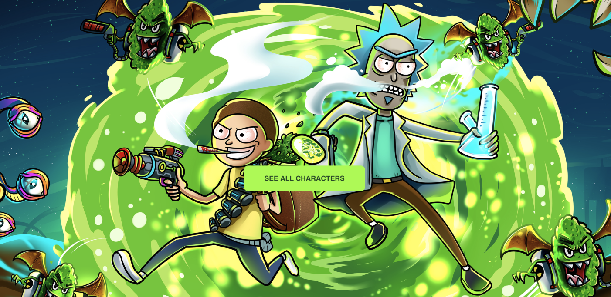

# REACT PROJECT | RICKYANDMORTY



## HOW TO USE

### 1. Install all dependencies: 
```bash
$ yarn 
# or 
$ npm install
```

### 2. Run the project in dev mode:
```bash
$ yarn dev
# or
npm run dev
```

### 3. Open Browser
Open [http://localhost:3000](http://localhost:3000) with your browser to see the result.


## Technology Stack

*React Project* build with 

- **NextJS**: react framework
- **TypeScript**
- **Redux**: state management library
- **Redux-thunk**
- **Material-UI**: component library
- **lazysizes**: lazy loading images


## PROJECT OVERVIEW

Using the [Rick & Morty API](rickandmortyapi.com) display the profiles of the characters (either
with pagination or showing the first page only).

The API provides REST and GraphQL versions, for this exercise **you should use the REST
version.**

You are free to use any library/framework or even language. Be ready to explain the rationale
for your choices.


### Main User Stories
| US | Description |
| :------------ | :----------- |
| **#1**: |  The profile of a character should include **Image** |
| **#2**: | The profile of a character should include **Character information** (`name`, `species`, `etc..`) |
| **#3**: | The profile of a character should include **Origin and location information** (`name`, `dimension`, `amount of residents`, `etc..`). |
| **#4**: | The profile of a character should include **Name of the chapters** the character is featured on. |


### Deployment

- The exercise should be submitted in a public repository. 
- Make sure that running your solution requires no global dependencies (besides node/npm/yarn) and it's possible to run it with only one command (besides yarn/npm install).

> Write the code with production standards in mind.
